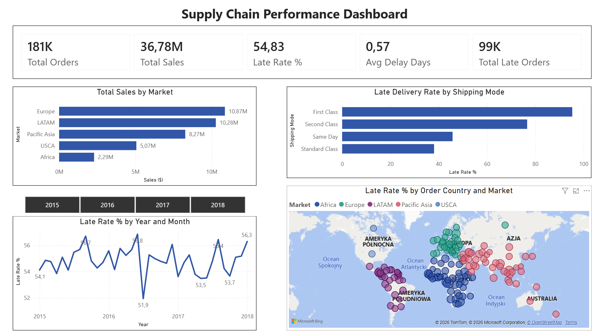
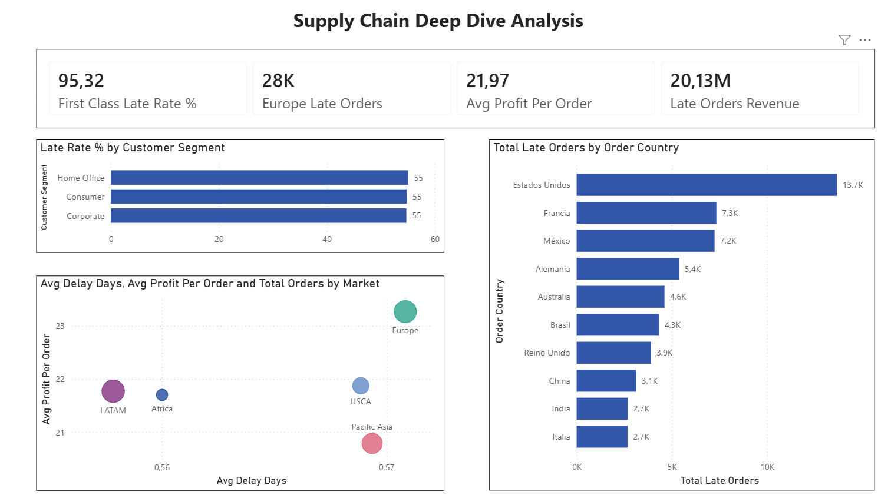

# Supply Chain Performance Analysis

End-to-end data analysis project combining **Python**, **SQL (DuckDB)** and **Power BI** to identify late delivery patterns across 180,000+ global supply chain orders.

---

## Business Problem

A global e-commerce company operates across 5 markets (Europe, LATAM, Pacific Asia, USCA, Africa) with 4 shipping modes. This project investigates **why deliveries are late, which areas are most affected, and what it costs the business.**

---

## Dashboard Preview

### Overview


### Deep Dive Analysis


---

## Key Findings

| Finding | Detail |
|---|---|
| **54.45% late delivery rate** | More than half of all orders arrive after the promised date |
| **First Class = 95% late rate** | The most expensive shipping mode performs worst |
| **Standard Class = 38% late rate** | The cheapest option delivers most reliably |
| **$20.13M revenue at risk** | Over 54% of total revenue comes from late orders |
| **Persistent problem 2015–2017** | Late rate stays at 54–56% with no sustained improvement — structural issue confirmed |
| **Problem is global** | All regions show 53–57% late rate — no regional outlier |

---

## Root Cause Analysis

The data reveals a **systemic planning problem**, not a logistics or regional issue:

- Average shipping time is identical across all markets (~3.5 days)
- Late delivery rate is consistent across all customer segments (Consumer, Corporate, Home Office)
- Premium shipping modes promise tighter windows but lack the operational buffer to meet them
- 3-year rolling average shows no improvement despite operational changes

> **Business recommendation:** Re-evaluate promised delivery windows for First Class and Second Class shipping.

---

## Tools & Techniques

### Python (Pandas)
- Exploratory Data Analysis (EDA)
- Data cleaning: removed 100% empty columns, fixed data types, handled missing values
- Feature engineering: created `delay_days` column (actual vs scheduled shipping days)

### SQL (DuckDB)
- Basic aggregations: `GROUP BY`, `HAVING`, `ORDER BY`
- Conditional aggregation: `CASE WHEN` for late delivery rate calculation
- `Subquery`: orders above global average sales value
- `CTE` (Common Table Expression): multi-step regional performance analysis
- `Window Functions`: `RANK() OVER PARTITION BY` for regional ranking, 3-month rolling average with `ROWS BETWEEN 2 PRECEDING AND CURRENT ROW`

### Power BI
- Power Query: data type corrections, locale handling (decimal separator)
- DAX measures in dedicated `_Measures` table:
  - `Late Rate %` using `DIVIDE()` for safe division
  - `CALCULATE()` for context-filtered KPIs (First Class Late Rate, Europe Late Orders)
  - `Total Orders`, `Total Sales`, `Avg Delay Days`, `Late Orders Revenue`
- 2-page report: **Overview** (global KPIs) + **Deep Dive** (segment analysis)
- Visualizations: KPI cards, bar charts, line chart with year slicer, map, scatter chart, Top N filter

---

## Dataset

**DataCo Smart Supply Chain for Big Data Analysis**  
Source: [Kaggle](https://www.kaggle.com/datasets/shashwatwork/dataco-smart-supply-chain-for-big-data-analysis)
> **Note:** Raw dataset is not included in this repository due to file size.  
> Download `DataCoSupplyChainDataset.csv` from Kaggle and run `01_eda.ipynb` to generate the cleaned dataset.

| Property | Value |
|---|---|
| Rows | 180,519 |
| Columns | 53 (49 after cleaning) |
| Period | 2015–2017 |
| Markets | Europe, LATAM, Pacific Asia, USCA, Africa |
| Shipping Modes | Standard Class, Second Class, First Class, Same Day |

---

## Project Structure

```
supply-chain-analysis/
│
├── 01_eda.ipynb                    # Data exploration, cleaning and visualization
├── 02_sql_analysis.ipynb           # SQL queries (Basic → Subquery → CTE → Window Functions)
├── queries.sql                     # Clean SQL queries (no Python wrapper)
├── DataCo.pbix                     # Power BI report (2 pages: Overview + Deep Dive)
├── Overview.png                    # Dashboard screenshot - Overview
├── Deepdive.png                    # Dashboard screenshot - Deep Dive
└── README.md
```

---

## Author

Data Analyst with 10+ years of supply chain operations experience.  
Combining domain expertise with data tools to solve real business problems.

*Skills: Python · SQL · Power BI · Supply Chain Analytics*

## License

This project is for educational and portfolio purposes.  
Dataset source: [DataCo Smart Supply Chain](https://www.kaggle.com/datasets/shashwatwork/dataco-smart-supply-chain-for-big-data-analysis) — used for non-commercial analysis only.
